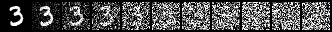
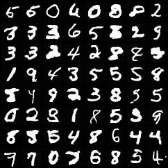
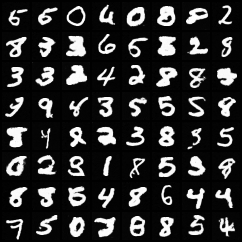
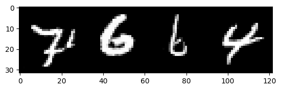
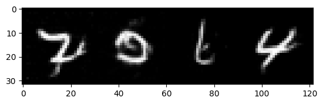
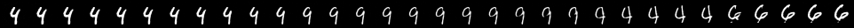
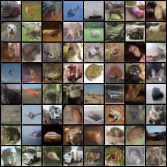
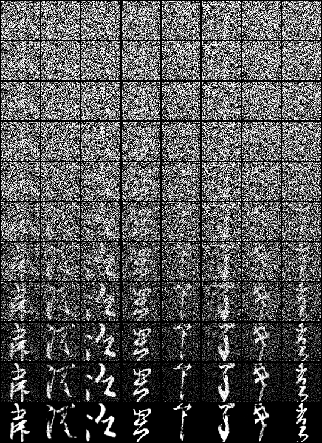
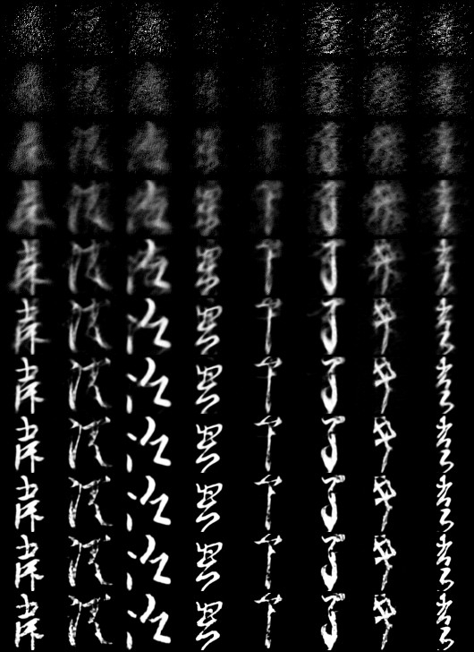

# Denoising Diffusion Implicit Models in a nutshell

## Introduction

Generative models are machine learning models used to create new data samples from old ones. For example we could fit a model to images of faces, and use the model to create new ones. A generative model can be *conditional*, where an additional input can be provided to guide the generation process. Recent popular examples include [DALL·E](https://openai.com/dall-e-2/), where an image is generated based on a user-provided text snippet.

Generative models can be used for a various of purposes in machine learning. One natural application is generation of synthetic data for training other machine learning models. Generative models can also be used to fill in missing data, a procedure known as *imputation*. An example application could be filling in missing parts of a picture, or predicting the rating a customer would give to an unseen movie. In the final section, we show an example of *image interpolation*, where one image is slowly transformed to an other one, mixing features of one to the other in the process.

In this note, we focus on Denoising Diffusion Implicit Models (DDIM), a non-conditional generative model developed by [Song, Chen and Ermon (2020)](https://arxiv.org/abs/2010.02502).
We give a brief summary of the mathematics of DDIM in a digestible form, interspersed with examples and code snippets.
An implementation based on the code snippets can be found in the repository.
Finally, we compare DDIM to the related Denoising Diffusion Probabilistic Models (DDPM), summarize the main differences and compare performance.

As a technical point, we note that the method described below is a special case of a family of models described by [Song, Chen and Ermon (2020)](https://arxiv.org/abs/2010.02502). The original paper describes a family of models parametrized by a vector of parameters $\sigma$; here we make the choice $\sigma = 0$.

## The big picture

Diffusion models such as DDIM work by slowly turning a input image into random noise in several steps. During this procedure, we train a machine learning model to "learn the noise". To generate a new random picture, we start with random noise, and undo the noise step by step using our model. The final result is a brand new picture, sharing some features of our training images.

### Noising process

 We denote by $x_t$ the image at step $t$. Thus $x_0$ is the original image, and we denote by $x_T$ the fully noised image. We set $T = 1000$. Below is an illustration of the noising process, with samples of $x_0, x_{100}, x_{200}, \dotsc, x_{1000}$ plotted.
 
 

The amount of noise added at each step is controlled by a parameter $\alpha_t$, so that $\alpha_t$ is decreasing, $\alpha_0 = 1$ and $\alpha_T \approx 0$. Given an initial image $x_0$, we define the noised image at step $t$ by
$$
x_t = \sqrt{\alpha_{t}} x_0 + \sqrt{1-\alpha_{t}} \epsilon_t, \label{foo} \tag{1}
$$
where $\epsilon_t \sim \mathcal{N}(0,I)$ is a standard Gaussian random variable, i.e. random noise. 

The reason for the choice of $\alpha_t$ is now clear.
Suppose $t$ is small, so $\alpha_t$ is close to $1$. Then $\sqrt{\alpha_t}$ is close to 1, and $\sqrt{1-\alpha_t}$ is close to zero, to the image $x_t$ is mostly the original image $x_0$, with noise close to zero.
On the opposite side, if $t$ is large, then $\alpha_t$ is close to $0$, so $\sqrt{\alpha_t} \approx 0$, and $\sqrt{1-\alpha_t} \approx 1$. This means that for large $t$, $x_t$ is mostly noise, with an almost-zero influence from $x_0$.

We fix an adequate set of parameters $\alpha_t$. The original DDIM paper provides an emipirically reasonable choice, which is described in the implementation section below.

### Denoising process

In DDIM, denoising means recovering $x_{t-1}$ from $x_{t}$ and $x_0$. The denoising procedure is defined as follows:
$$
x_{t-1} = \sqrt{\alpha_{t-1}} x_0 + \sqrt{1-\alpha_{t-1}}\epsilon_t \tag{2}
$$
We note a few interesting properties of the formula above. First, we observe that equation (2) is very similar to (1), the only difference being the noise used to get $x_{t-1}$ is actually precisely the same as the one for $x_t$. This means that, **given $x_0$ and $x_t$**, we obtain the previous image $x_{t-1}$ by first finding the noise used to generate $x_t$, and then applying that, with proper scaling, to generate $x_{t-1}$.

Second, note that equation (2) indeed depends on $x_t$, since $\epsilon_t$ can be recovered from equation (1). Indeed, if we solve (1) for $\epsilon_t$, we get $\epsilon_t = (x_t - \sqrt{a_t} x_0) / \sqrt{1-\alpha_t}$.

Third, and most importantly, denoising **depends on $x_0$**. This is a problem, as it means that to remove noise from $x_t$, we would need to know the original picture $x_0$, thus completely defeating the purpose of the model.

### Machine learning to the rescue

When denoising, we would like to obtain $x_{t-1}$ from $x_t$, without having to know $x_0$. Thus our goal will be to *learn* the noise $\epsilon_t$ used to generate $x_t$ using equation (1).
Learning will be done using a machine learning model, denoted by $\epsilon_\theta^{(t)}$, so that $\epsilon_\theta^{(t)}(x_t)$ is an estimate for $\epsilon_t$ in equation (1). The set of parameters $\theta$ is chosen as to minimize the squared error of our estimate $\epsilon_\theta^{(t)}(x_t)$ compared to a "true" noise $\epsilon_t$.

The training procedure is as follows:
1. Choose a random input image $x_0$ from the training set.
2. Choose a random time $t$ between 1 and $T$.
3. Choose a random noise $\epsilon_t$ from a standard normal distribution
4. Let $x_t = \sqrt{a_t} x_0 + \sqrt{1-\alpha_t} \epsilon_t$
5. Compute the square error between $\epsilon_\theta^{(t)}(x_t)$ and $\epsilon_t$, i.e. $\mathrm{loss} = \| \epsilon_\theta^{(t)}(x_t) - \epsilon_t \|^2_2$.
6. Change parameters $\theta$ so that $\mathrm{loss}$ decreases. In practice, we compute a gradient of the loss function with respect to $\theta$, and take a gradient descent step.

We repeat the above steps until the parameters stabilize.

### Generating samples

We now have all ingredients necessary to reverse the noising procedure.
To obtain a random sample, we start from an $x_T$ consisting of only random noise.
Then, using equation (2) as a blueprint, we compute $x_{T-1}, x_{T-2}, \dotsc, x_0$ step by step, filling in unavailable values $x_0$ and $\epsilon_t$ using our trained model.

To get $x_{t-1}$ from $x_t$, we proceed as follows:
1. Use the machine learning model to produce $\epsilon_\theta^{(t)}(x_t)$. This will serve as our proxy for $\epsilon_t$.
2. Estimate $x_0$ by solving equation (1) for $x_0$ and using $\epsilon_\theta^{(t)}(x_t)$ in place of $\epsilon_t$. The paper calls this estimate $f_\theta^{(t)}(x_t)$, and is defined as $$f^{(t)}_\theta(x_t) = (x_t - \sqrt{1-\alpha_t} \epsilon_{\theta}^{(t)}(x_t)) / \sqrt{\alpha_t}$$
3. Compute $x_{t-1}$ from equation (2) using estimates for $\epsilon_t$ and $x_0$ computed in steps 1 and 2. In symbols $$ x_{t-1} = \sqrt{\alpha_{t-1}} f_\theta^{(t)}(x_t) + \sqrt{1-\alpha_{t-1}} \epsilon_\theta^{(t)}(x_t)$$

We repeat the steps above, going backwards from $x_T$ all the way to $x_0$.

### Faster sampling

Due to the dependence on $x_0$ of the denoising proceduce, we may go from $x_T$ to $x_0$ by skipping some timesteps. The intuitive idea is very similar to the above. Suppose for example we want to go from $x_{200}$ to $x_{100}$ in one go. We use our model to estimate $\epsilon_{200}$ and $x_0$ just as above, and then set $x_{100} = \sqrt{\alpha_{100}} x_0 + \sqrt{1 - \alpha_{100}} \epsilon_{200}$.

For completeness, we describe the steps of the accelerated sampling procedure. Suppose we have a subset $\tau_0 < \tau_1 < \dotsc < \tau_s$, where $\tau_0 = 0$ and $\tau_s = T$. Then, starting from $x_T$, we get $x_0$ by the following procedure
1. Set $t = \tau_i$
1. Use the machine learning model to produce $\epsilon_\theta^{(t)}(x_t)$.
2. Estimate $x_0$ by $$f^{(t)}_\theta(x_t) = (x_t - \sqrt{1-\alpha_t} \epsilon_{\theta}^{(t)}(x_t)) / (\sqrt{\alpha_t}) $$
3. Compute $x_{\tau_{i-1}}$ from equation (2) using estimates for $\epsilon_t$ and $x_0$ computed in steps 1 and 2. In symbols $$ x_{\tau_{i-1}} = \sqrt{\alpha_{\tau_{i-1}}} f_\theta^{(t)}(x_t) + \sqrt{1-\alpha_{\tau_{i-1}}} \epsilon_\theta^{(t)}(x_t)$$

The above steps are repeated $s$ times, which can often be chosen to be much smaller than $T$.

The accelerated sampling procedure can produce worse looking samples and spurious artifacts, but one can often massively reduce the number of required sampling steps and keep the image quality of the full sampling method. Below we present an example of the model trained on MNIST images. The first image consists of 32 generated digits, starting from random noise and going through each step


We then use the same starting noise and skip some steps to obtain the images below. In order, we skip 5, 10, and 100 steps at a time. Naturally, the speedup scales linearly, so that skipping 100 steps at a time will yield samples 100 times faster as going through each step.

  

We observe that the sample quality is barely affected, even when skipping 100 steps at a time. Careful inspection will reveal some artifacts, for example the number 9 on the top right looks more like an 8.

## Minimal implementation

In this section we describe a simple implementation in PyTorch, training on the MNIST dataset.

We start with the usual boilerplate imports and dataset definitions


```python
import matplotlib.pyplot as plt
import numpy as np

import torch
import torchvision
import torchvision.transforms as transforms
import torchvision.transforms.functional as TF

import torch.nn as nn
import torch.nn.functional as F
import torch.optim as optim

from copy import deepcopy

# Cuda
if torch.cuda.is_available():
    device = torch.device('cuda')
else:
    device = torch.device('cpu')
print(f'Using {device}')

# Load dataset
dataset = torchvision.datasets.MNIST(root = ".",
                                    download = True,
                                    transform = transforms.ToTensor())
dataloader = torch.utils.data.DataLoader(dataset,
                                        batch_size=500,
                                        shuffle=True,
                                        num_workers=4)

```

    Using cpu


For the neural network architecture underlying $\epsilon_\theta^{(t)}$, we use the same one as the DDIM and DDPM papers, which is a variant of a U-net. An implementation in PyTorch is available at [on Github](https://github.com/pesser/pytorch_diffusion), from where we obtained the file [models.py](models.py). Parameters are chosen based on the original DDIM paper, adapted to MNIST images.


```python
from models import Model
model = Model(resolution=28,
                in_channels=1,
                out_ch=1,
                ch=128,
                ch_mult=(1,2,2),
                num_res_blocks=2,
                attn_resolutions=(14,),
                dropout=0.1).to(device)
```

We define our fixed parameters $T, \alpha$, and our loss function and optimizer. We set $T = 1000$, and choose the same $\alpha$ as the original paper, which is constructed using an auxiliary parameter $\beta$.


```python
optimizer = torch.optim.Adam(model.parameters(), lr = 0.0002)
loss_fcn = nn.MSELoss()
T = 1000
beta = torch.linspace(0.0001, 0.02, T) # same beta as in DDPM
alpha = torch.cat([torch.tensor([1.]), torch.cumprod(1.-beta,0)]).to(device) # same alpha as in DDIM
```

As required, $\alpha$ is a decreasing vector, going from 1 to almost 0.


```python
alpha
```


    tensor([1.0000e+00, 9.9990e-01, 9.9978e-01,  ..., 4.2022e-05, 4.1182e-05,
            4.0358e-05])


Next, the training procedure. Our pictures $x_0$ are given as arrays of pixel intensities, ranging from 0 to 1. We start by rescaling them to $[-1,1]$ as required by DDIM. We choose a random vector of values $t$, random noise, and compute $x_t$ based on equation (1). We feed our noisy sample to `model` to get an estimate for $\epsilon_t$, and compare the output to the true noise `noise`.
## We don't want to run this in the notebook ##

## Train
model.train()
epochs = 30
for epoch in range(epochs):
    for XX, y in dataloader:
        X = (XX * 2. - 1.).to(device)
        t = (torch.randint(T, (X.shape[0],)) + 1).to(device)
        noise = torch.randn(X.shape, device = device)
        Xt = alpha[t,None,None,None].sqrt() * X + (1-alpha[t,None,None,None]).sqrt() * noise
        loss = loss_fcn(model(Xt, t), noise)
        print(f'epoch {epoch}, loss: {loss}')
        optimizer.zero_grad()
        loss.backward()
        optimizer.step()
    chkpt = deepcopy(model.state_dict())
    torch.save(chkpt, "checkpoint.pt")
torch.save(chkpt, "mnist_weights.pt")
Once the model is trained, we can sample. We start with the "slow" sampling scheme, going through every timestep in reverse. The variable `eps` is our current estimate for $\epsilon_t$, and `X0` is our estimate for $x_0$. The variable `Xt` denotes the previous timestep, which is obtained by applying equation (2) using our estimates.


```python
model.load_state_dict(torch.load("mnist_weights.pt", map_location=device))
model.eval()
sample_size = 4
## Normal sample
XT = torch.randn((sample_size,1,28,28), device=device)
with torch.no_grad():
    Xt = XT
    for t in range(T,0,-1):
        print(t)
        t_tensor = torch.full((Xt.shape[0],), t, device=device)
        eps = model(Xt, t_tensor)
        X0 = (Xt - (1-alpha[t]).sqrt() * eps) / alpha[t].sqrt()
        Xt = alpha[t-1].sqrt() * X0 + (1-alpha[t-1]).sqrt() * eps
```

    1000
    999
    998
    997
    996
    995
    994
    993
    992
    991
    990
    989
    988
    987
    986
    985
    984
    983
    982
    981
    980
    979
    978
    977
    976
    975
    974
    973
    972
    971
    970
    969
    968
    967
    966
    965
    964
    963
    962
    961
    960
    959
    958
    957
    956
    955
    954
    953
    952
    951
    950
    949
    948
    947
    946
    945
    944
    943
    942
    941
    940
    939
    938
    937
    936
    935
    934
    933
    932
    931
    930
    929
    928
    927
    926
    925
    924
    923
    922
    921
    920
    919
    918
    917
    916
    915
    914
    913
    912
    911
    910
    909
    908
    907
    906
    905
    904
    903
    902
    901
    900
    899
    898
    897
    896
    895
    894
    893
    892
    891
    890
    889
    888
    887
    886
    885
    884
    883
    882
    881
    880
    879
    878
    877
    876
    875
    874
    873
    872
    871
    870
    869
    868
    867
    866
    865
    864
    863
    862
    861
    860
    859
    858
    857
    856
    855
    854
    853
    852
    851
    850
    849
    848
    847
    846
    845
    844
    843
    842
    841
    840
    839
    838
    837
    836
    835
    834
    833
    832
    831
    830
    829
    828
    827
    826
    825
    824
    823
    822
    821
    820
    819
    818
    817
    816
    815
    814
    813
    812
    811
    810
    809
    808
    807
    806
    805
    804
    803
    802
    801
    800
    799
    798
    797
    796
    795
    794
    793
    792
    791
    790
    789
    788
    787
    786
    785
    784
    783
    782
    781
    780
    779
    778
    777
    776
    775
    774
    773
    772
    771
    770
    769
    768
    767
    766
    765
    764
    763
    762
    761
    760
    759
    758
    757
    756
    755
    754
    753
    752
    751
    750
    749
    748
    747
    746
    745
    744
    743
    742
    741
    740
    739
    738
    737
    736
    735
    734
    733
    732
    731
    730
    729
    728
    727
    726
    725
    724
    723
    722
    721
    720
    719
    718
    717
    716
    715
    714
    713
    712
    711
    710
    709
    708
    707
    706
    705
    704
    703
    702
    701
    700
    699
    698
    697
    696
    695
    694
    693
    692
    691
    690
    689
    688
    687
    686
    685
    684
    683
    682
    681
    680
    679
    678
    677
    676
    675
    674
    673
    672
    671
    670
    669
    668
    667
    666
    665
    664
    663
    662
    661
    660
    659
    658
    657
    656
    655
    654
    653
    652
    651
    650
    649
    648
    647
    646
    645
    644
    643
    642
    641
    640
    639
    638
    637
    636
    635
    634
    633
    632
    631
    630
    629
    628
    627
    626
    625
    624
    623
    622
    621
    620
    619
    618
    617
    616
    615
    614
    613
    612
    611
    610
    609
    608
    607
    606
    605
    604
    603
    602
    601
    600
    599
    598
    597
    596
    595
    594
    593
    592
    591
    590
    589
    588
    587
    586
    585
    584
    583
    582
    581
    580
    579
    578
    577
    576
    575
    574
    573
    572
    571
    570
    569
    568
    567
    566
    565
    564
    563
    562
    561
    560
    559
    558
    557
    556
    555
    554
    553
    552
    551
    550
    549
    548
    547
    546
    545
    544
    543
    542
    541
    540
    539
    538
    537
    536
    535
    534
    533
    532
    531
    530
    529
    528
    527
    526
    525
    524
    523
    522
    521
    520
    519
    518
    517
    516
    515
    514
    513
    512
    511
    510
    509
    508
    507
    506
    505
    504
    503
    502
    501
    500
    499
    498
    497
    496
    495
    494
    493
    492
    491
    490
    489
    488
    487
    486
    485
    484
    483
    482
    481
    480
    479
    478
    477
    476
    475
    474
    473
    472
    471
    470
    469
    468
    467
    466
    465
    464
    463
    462
    461
    460
    459
    458
    457
    456
    455
    454
    453
    452
    451
    450
    449
    448
    447
    446
    445
    444
    443
    442
    441
    440
    439
    438
    437
    436
    435
    434
    433
    432
    431
    430
    429
    428
    427
    426
    425
    424
    423
    422
    421
    420
    419
    418
    417
    416
    415
    414
    413
    412
    411
    410
    409
    408
    407
    406
    405
    404
    403
    402
    401
    400
    399
    398
    397
    396
    395
    394
    393
    392
    391
    390
    389
    388
    387
    386
    385
    384
    383
    382
    381
    380
    379
    378
    377
    376
    375
    374
    373
    372
    371
    370
    369
    368
    367
    366
    365
    364
    363
    362
    361
    360
    359
    358
    357
    356
    355
    354
    353
    352
    351
    350
    349
    348
    347
    346
    345
    344
    343
    342
    341
    340
    339
    338
    337
    336
    335
    334
    333
    332
    331
    330
    329
    328
    327
    326
    325
    324
    323
    322
    321
    320
    319
    318
    317
    316
    315
    314
    313
    312
    311
    310
    309
    308
    307
    306
    305
    304
    303
    302
    301
    300
    299
    298
    297
    296
    295
    294
    293
    292
    291
    290
    289
    288
    287
    286
    285
    284
    283
    282
    281
    280
    279
    278
    277
    276
    275
    274
    273
    272
    271
    270
    269
    268
    267
    266
    265
    264
    263
    262
    261
    260
    259
    258
    257
    256
    255
    254
    253
    252
    251
    250
    249
    248
    247
    246
    245
    244
    243
    242
    241
    240
    239
    238
    237
    236
    235
    234
    233
    232
    231
    230
    229
    228
    227
    226
    225
    224
    223
    222
    221
    220
    219
    218
    217
    216
    215
    214
    213
    212
    211
    210
    209
    208
    207
    206
    205
    204
    203
    202
    201
    200
    199
    198
    197
    196
    195
    194
    193
    192
    191
    190
    189
    188
    187
    186
    185
    184
    183
    182
    181
    180
    179
    178
    177
    176
    175
    174
    173
    172
    171
    170
    169
    168
    167
    166
    165
    164
    163
    162
    161
    160
    159
    158
    157
    156
    155
    154
    153
    152
    151
    150
    149
    148
    147
    146
    145
    144
    143
    142
    141
    140
    139
    138
    137
    136
    135
    134
    133
    132
    131
    130
    129
    128
    127
    126
    125
    124
    123
    122
    121
    120
    119
    118
    117
    116
    115
    114
    113
    112
    111
    110
    109
    108
    107
    106
    105
    104
    103
    102
    101
    100
    99
    98
    97
    96
    95
    94
    93
    92
    91
    90
    89
    88
    87
    86
    85
    84
    83
    82
    81
    80
    79
    78
    77
    76
    75
    74
    73
    72
    71
    70
    69
    68
    67
    66
    65
    64
    63
    62
    61
    60
    59
    58
    57
    56
    55
    54
    53
    52
    51
    50
    49
    48
    47
    46
    45
    44
    43
    42
    41
    40
    39
    38
    37
    36
    35
    34
    33
    32
    31
    30
    29
    28
    27
    26
    25
    24
    23
    22
    21
    20
    19
    18
    17
    16
    15
    14
    13
    12
    11
    10
    9
    8
    7
    6
    5
    4
    3
    2
    1


At the end, we constrain our pixel values to the range $[-1,1]$, rescale to the range $[0,1]$, and finally we plot the results.


```python
X0_clip = (torch.clip(Xt, -1., 1.) + 1.) / 2.
plt.imshow(TF.to_pil_image(torchvision.utils.make_grid(X0_clip)))
```


    <matplotlib.image.AxesImage at 0x11b7719d0>


    

    


The accelerated sampling procedure is implemented similarly. Below we visit only every 250th timestep. Thus sampling ends after 4 steps, as opposed to 1000, a massive reduction in sampling time. We use the same initial $X_T$ as above, and the result is similar, although suffers a little bit from the small number of steps.


```python
tau = list(range(0,T+1,250))
alpha_tau = alpha[tau]
n_tau = len(tau) - 1
# Fast sample
with torch.no_grad():
    Xt = XT
    for i in range(n_tau, 0, -1):
        t = tau[i]
        print(t)
        t_tensor = torch.full((Xt.shape[0],), t, device=device)
        eps = model(Xt, t_tensor)
        X0 = (Xt - (1-alpha_tau[i]).sqrt() * eps) / alpha_tau[i].sqrt()
        Xt = alpha_tau[i-1].sqrt() * X0 + (1-alpha_tau[i-1]).sqrt() * eps
X0_clip = (torch.clip(Xt, -1., 1.) + 1.) / 2.
plt.imshow(TF.to_pil_image(torchvision.utils.make_grid(X0_clip)))
```

    1000
    750
    500
    250


    <matplotlib.image.AxesImage at 0x11c688c40>


    

    


## Comparing to DDPM

DDIM was developed as an improvement over the earlier Denoising Diffusion Probabilistic Models (DDPM), by [Ho, Jain, and Abbeel (2020)](https://arxiv.org/pdf/2006.11239.pdf). As the name suggests, DDPM is also a diffusion based model, where training images are slowly turned to noise, and a machine learning model is used to learn the transitions.

DDIM and DDPM are very closely related, and authors of DDIM carefully crafted various distributions in their model in order to preserve compatibility with the earlier DDPM. As a result, the noising procedure and training objectives for DDPM and DDIM are precisely the same, and thus a trained DDPM model can be used to sample a DDIM model.

The key difference lies in the description of the *denoising* procedure. In practice, DDPM models do not support faster sampling by skipping steps. The technical reason is that the noising process in DDPM is described as a *Markov chain*, where the next step $x_{t+1}$ depends only on the current step $x_t$, and knowing or estimating the initial, non-noisy image $x_0$ yields no extra information. With this assumption in mind, we need to pass through every step when sampling a DDPM. In contrast, in DDIM the next step $x_{t+1}$ is viewed as depending on both the current step $x_t$, and the original image $x_0$, and this additional information is used in the denoising scheme.

As we mentioned in the introduction, DDIM describes a familiy of models, parametrized by a vector $\sigma$. There is a choice of $\sigma$ that recovers the exact denoising procedure of DDPM. Thus we can think of DDPM as a special case of DDIM, where the dependence on $x_0$ in the denoising procedure is removed.

## Examples

We use the script [mnist_train.py](mnist_train.py) to train a generative model for the MNIST dataset. We train for 30 epochs. While this is relatively low, it still returns acceptable samples. An example for sampling can be found in [mnist_sample.py](mnist_sample.py). All images of handwritten digits above were obtain using our self-trained model.

We demonstrate one feature of generative models, *interpolation*. We start with two sets of random noise $x_T^{(0)}$ and $x_T^{(1)}$. We can smoothly interpolate between the noise by setting $x_T^{(\lambda)} = \lambda x_T^{(1)} + (1-\lambda) x_T^{(0)}$. Thus when $\lambda = 0$ or $1$ we recover $x_T^{(0)}$ or $x_T^{(1)}$ respectively, and when $\lambda$ is between $0$ and $1$, we get a mixture of our noise. We then denoise both $x_T^{(0)}$, $x_T^{(1)}$ and a few pictures inbetween to obtain the sequence below. We see a number 4 slowly become a number 9, and then changing to a 6.



For the CIFAR10 dataset, we download [pretrained DDPM model weights](https://heibox.uni-heidelberg.de/d/01207c3f6b8441779abf/) courtesy of the following reimplementation of the original DDPM model in Pytorch: https://github.com/pesser/pytorch_diffusion. This set of weights is trained for 790000 epochs. Below we randomly generate 64 samples in 10 timesteps. This takes about a minute on a several years old MacBook Pro, and under a second on a GPU. If we were to use every timestep, for example when using DDPM, we would have to spend about 100 minutes on the MacBook. The code to generate the image below can be found in [cifar_sample.py](cifar_sample.py).



As a final example, we train a DDIM on $64 \times 64$, monochrome images of handwritten Kanji. We use the [Kuzushiji-Kanji](https://github.com/rois-codh/kmnist#kuzushiji-kanji) dataset, containing a total of 140,426 images of 3832 characters. We can visualize the denoising process by plotting intermediate results. The following plots are given by a model trained over only 5 epochs.



Since at each step we have an estimate of $x_0$, we can observe how the model's predictions evolve over time


