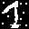
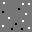
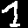
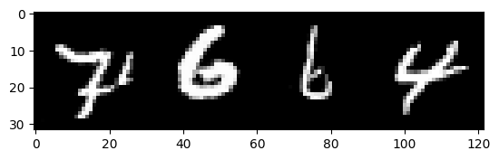
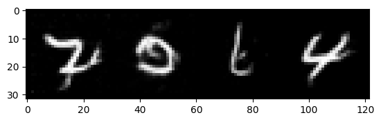

# Denoising Diffusion Implicit Models in a nutshell

## Introduction

Generative models are machine learning models used to create new data samples from old ones. For example we could fit a model to images of faces, and use the model to create new ones. A generative model can be *conditional*, where an additional input can be provided to guide the generation process. Recent popular examples include [DALL·E](https://openai.com/dall-e-2/), where an image is generated based on a user-provided text snippet.

Generative models can be used for a various of purposes in machine learning. One natural application is generation of synthetic data for training other machine learning models. Generative models can also be used to fill in missing data, a procedure known as *imputation*. An example application could be filling in missing parts of a picture, or predicting the rating a customer would give to an unseen movie. In the final section, we show an example of *image interpolation*, where one image is slowly transformed to an other one, mixing features of one to the other in the process.

In this note, we focus on Denoising Diffusion Implicit Models (DDIM), a non-conditional generative model developed by [Song, Chen and Ermon (2020)](https://arxiv.org/abs/2010.02502).
We give a brief summary of the mathematics of DDIM in a digestible form, interspersed with examples and code snippets.
An implementation based on the code snippets can be found in the repository.
Finally, we compare DDIM to the related Denoising Diffusion Probabilistic Models (DDPM), summarize the main differences and compare performance.

As a technical point, we note that the method described below is a special case of a family of models described by [Song, Chen and Ermon (2020)](https://arxiv.org/abs/2010.02502). The original paper describes a family of models parametrized by a vector of parameters $\sigma$; here we make the choice $\sigma = 0$.

## The big picture

Diffusion models such as DDIM work by slowly turning a input image into random noise in several steps. During this procedure, we train a machine learning model to "learn the noise". To generate a new random picture, we start with random noise, and undo the noise step by step using our model. The final result is a brand new picture, sharing some features of our training images.

### Noising process

 We denote by $x_t$ the image at step $t$. Thus $x_0$ is the original image, and we denote by $x_T$ the fully noised image. We set $T = 1000$. Below is an illustration of the noising process, with samples of $x_0, x_{100}, x_{200}, \dotsc, x_{1000}$ plotted.
 
 

The amount of noise added at each step is controlled by a parameter $\alpha_t$, so that $\alpha_t$ is decreasing, $\alpha_0 = 1$ and $\alpha_T \approx 0$. Given an initial image $x_0$, we define the noised image at step $t$ by

$$
x_t = \sqrt{\alpha_{t}} x_0 + \sqrt{1-\alpha_{t}} \epsilon_t, \tag{1}
$$

where $\epsilon_t \sim \mathcal{N}(0,I)$ is a standard Gaussian random variable, i.e. random noise. 

The reason for the choice of $\alpha_t$ is now clear.
Suppose $t$ is small, so $\alpha_t$ is close to $1$. Then $\sqrt{\alpha_t}$ is close to 1, and $\sqrt{1-\alpha_t}$ is close to zero, to the image $x_t$ is mostly the original image $x_0$, with noise close to zero.
On the opposite side, if $t$ is large, then $\alpha_t$ is close to $0$, so $\sqrt{\alpha_t} \approx 0$, and $\sqrt{1-\alpha_t} \approx 1$. This means that for large $t$, $x_t$ is mostly noise, with an almost-zero influence from $x_0$. Note that it is important that the influence of $x_t$ is **almost** zero, but not too close to zero either, because we want some signal from $x_0$ to show up in $x_T$. If $\alpha_T$ is too close to zero, we will only learn random noise, and be unable to reverse the noising process.

We fix an adequate set of parameters $\alpha_t$. The original DDIM paper provides an emipirically reasonable choice, which is described in the implementation section below.

### Denoising process

In DDIM, denoising means recovering $x_{t-1}$ from $x_{t}$ and $x_0$. The denoising procedure is defined as follows:

$$
x_{t-1} = \sqrt{\alpha_{t-1}} x_0 + \sqrt{1-\alpha_{t-1}}\epsilon_t \tag{2}
$$

We note a few interesting properties of the formula above. First, we observe that equation (2) is very similar to (1), the only difference being the noise used to get $x_{t-1}$ is actually precisely the same as the one for $x_t$. This means that, **given $x_0$ and $x_t$**, we obtain the previous image $x_{t-1}$ by first finding the noise used to generate $x_t$, and then applying that, with proper scaling, to generate $x_{t-1}$.

Second, note that equation (2) indeed depends on $x_t$, since $\epsilon_t$ can be recovered from equation (1). Indeed, if we solve (1) for $\epsilon_t$, we get $\epsilon_t = (x_t - \sqrt{a_t} x_0) / \sqrt{1-\alpha_t}$.

Third, and most importantly, denoising **depends on $x_0$**. This is a problem, as it means that to remove noise from $x_t$, we would need to know the original picture $x_0$, thus completely defeating the purpose of the model.

### Machine learning to the rescue

When denoising, we would like to obtain $x_{t-1}$ from $x_t$, without having to know $x_0$. Thus our goal will be to *learn* the noise $\epsilon_t$ used to generate $x_t$ using equation (1).
Learning will be done using a machine learning model, denoted by $\epsilon_\theta^{(t)}$, so that $\epsilon_\theta^{(t)}(x_t)$ is an estimate for $\epsilon_t$ in equation (1). The set of parameters $\theta$ is chosen as to minimize the squared error of our estimate $\epsilon_\theta^{(t)}(x_t)$ compared to a "true" noise $\epsilon_t$.

The training procedure is as follows:
1. Choose a random input image $x_0$ from the training set.
2. Choose a random time $t$ between 1 and $T$.
3. Choose a random noise $\epsilon_t$ from a standard normal distribution
4. Let $x_t = \sqrt{a_t} x_0 + \sqrt{1-\alpha_t} \epsilon_t$
5. Compute the square error between $\epsilon_\theta^{(t)}(x_t)$ and $\epsilon_t$, i.e. $\mathrm{loss} = \| \epsilon_\theta^{(t)}(x_t) - \epsilon_t \|^2_2$.
6. Change parameters $\theta$ so that $\mathrm{loss}$ decreases. In practice, we compute a gradient of the loss function with respect to $\theta$, and take a gradient descent step.

We repeat the above steps until the parameters stabilize.

It may at first seem impossible, or even paradoxical, to train a machine to predict noise. The following human analogy might shed some light in what the model is doing. Suppose a human sees the image $x_t = $



Due to our extensive experience with numbers, we can guess that this is probably an image of the number 1, with some pixel values flipped. We might even be able to decompose the image as $\epsilon_t$ and $x_t$

 

Thus in this toy example, a human could guess what the noise looks like, even though it was chosen randomly.

### Generating samples

We now have all ingredients necessary to reverse the noising procedure.
To obtain a random sample, we start from an $x_T$ consisting of only random noise.
Then, using equation (2) as a blueprint, we compute $x_{T-1}, x_{T-2}, \dotsc, x_0$ step by step, filling in unavailable values $x_0$ and $\epsilon_t$ using our trained model.

To get $x_{t-1}$ from $x_t$, we proceed as follows:
1. Use the machine learning model to produce $\epsilon_\theta^{(t)}(x_t)$. This will serve as our proxy for $\epsilon_t$.
2. Estimate $x_0$ by solving equation (1) for $x_0$ and using $\epsilon_\theta^{(t)}(x_t)$ in place of $\epsilon_t$. The paper calls this estimate $f_\theta^{(t)}(x_t)$, and is defined as 

$$
f^{(t)}_\theta(x_t) = (x_t - \sqrt{1-\alpha_t} \epsilon_{\theta}^{(t)}(x_t)) / \sqrt{\alpha_t}
$$

3. Compute $x_{t-1}$ from equation (2) using estimates for $\epsilon_t$ and $x_0$ computed in steps 1 and 2. In symbols 

$$
x_{t-1} = \sqrt{\alpha_{t-1}} f_\theta^{(t)}(x_t) + \sqrt{1-\alpha_{t-1}} \epsilon_\theta^{(t)}(x_t)
$$

We repeat the steps above, going backwards from $x_T$ all the way to $x_0$.

### Faster sampling

Due to the dependence on $x_0$ of the denoising proceduce, we may go from $x_T$ to $x_0$ by skipping some timesteps. The intuitive idea is very similar to the above. Suppose for example we want to go from $x_{200}$ to $x_{100}$ in one go. We use our model to estimate $\epsilon_{200}$ and $x_0$ just as above, and then set $x_{100} = \sqrt{\alpha_{100}} x_0 + \sqrt{1 - \alpha_{100}} \epsilon_{200}$.

For completeness, we describe the steps of the accelerated sampling procedure. Suppose we have a subset $\tau_0 < \tau_1 < \dotsc < \tau_s$, where $\tau_0 = 0$ and $\tau_s = T$. Then, starting from $x_T$, we get $x_0$ by the following procedure
1. Set $t = \tau_i$
1. Use the machine learning model to produce $\epsilon_\theta^{(t)}(x_t)$.
2. Estimate $x_0$ by

$$
f^{(t)}_\theta(x_t) = (x_t - \sqrt{1-\alpha_t} \epsilon_{\theta}^{(t)}(x_t)) / (\sqrt{\alpha_t})
$$

3. Compute $x_{\tau_{i-1}}$ from equation (2) using estimates for $\epsilon_t$ and $x_0$ computed in steps 1 and 2. In symbols 

$$
x_{\tau_{i-1}} = \sqrt{\alpha_{\tau_{i-1}}} f_\theta^{(t)}(x_t) + \sqrt{1-\alpha_{\tau_{i-1}}} \epsilon_\theta^{(t)}(x_t)
$$

The above steps are repeated $s$ times, which can often be chosen to be much smaller than $T$.

The accelerated sampling procedure can produce worse looking samples and spurious artifacts, but one can often massively reduce the number of required sampling steps and keep the image quality of the full sampling method. Below we present an example of the model trained on MNIST images. The first image consists of 32 generated digits, starting from random noise and going through each step


We then use the same starting noise and skip some steps to obtain the images below. In order, we skip 5, 10, and 100 steps at a time. Naturally, the speedup scales linearly, so that skipping 100 steps at a time will yield samples 100 times faster as going through each step.

  

We observe that the sample quality is barely affected, even when skipping 100 steps at a time. Careful inspection will reveal some artifacts, for example the number 9 on the top right looks more like an 8.

## Mathematical details

In this section we give the statistical details and motivation behind DDIM. As mentioned above, the DDIM paper describes a family of models; here we focus on the implicit model. Since in the implicit setting many operations become deterministic, we introduce Dirac delta probability measures as a probability density on a deterministic event.

Our goal is to model the "true" probability distribution $q(x_0)$ on the space of images. Drawing a random sample from this distribution means sampling a random image. We view our training data as a set of random samples from this distribution.

Of course, there is no hope of ever writing down any equations for $q(x_0)$, as the distribution is very complex. Instead, we will attempt to *model* this distribution via another one called $p_\theta(x_0)$, where the subscript $\theta$ indicates a set of model parameters.  In our informal discussion above, the set of parameters $\theta$ is the set of weights in the neural network. Sampling $p_\theta(x_0)$ means generating random images, as we have done in the previous section. In order to model a distribution that generates similar samples to our training images, we will attempt to find parameters $\theta$ that maximizes the expected (log)-likelihood under the true data distribution $q(x_0)$.

Our strategy will go roughly as follows:
1. For each data point $x_0$, we describe a scheme to generate *latent* variables $x_1,\dotsc,x_T$, which gives us a joint distribution $q(x_0,x_1,\dotsc,x_T)$. This can be thought of as an *encoder*. Furthermore, this procedure is fixed; no parameters are learned.
2. We then define a procedure $p_\theta(x_{t-1} \mid x_t)$ for inferring the previous latent variable from the next one, and a simple distribution $p(x_T)$ to start the backwards process. In other words, we describe a *decoder*. We will define the joint distribution $p(x_0, \dotsc, x_T)$ so that the sequence $x_T,\dotsc,x_0$ is obtained by first sampling $x_T$, and then sampling each $p(x_{t-1} \mid x_t)$.
3. Given an image $x_0$, we aim to maximize the likelihood $p_\theta(x_0)$ by marginalizing over the latent variables. This will be intractable, but we can derive a lower bound. We will see that maximizing this lower bound will end up minimizing the "distance" between the forward and backward processes. Since the forward procedure is fixed, we use this to motivate our choices of $p_\theta(x_{t-1} \mid x_t)$.

### Evidence lower bound

We will study the DDIM model in a reversed order compared to the above list. We start by describing the desired lower bound for the log-likelihood. Next, we will describe the reverse distribution $p_\theta(x_0,\dotsc,x_T)$ that aims to approximate $q(x_0,\dotsc,x_T)$. This will be chosen to maximize the lower bound of the log-likelihood. Finally, we describe the forward procedure $q(x_0,\dotsc,x_T)$ in a way that is compatible with DDPM.

Suppose $x_0$ is sampled from the data distribution $q(x_0)$. We want to maximize the likelihood $p_\theta(x_0) = \int p_\theta(x_0,x_1,\dotsc,x_T) d(x_1,\dotsc,x_T)$. This is in general intractable, as $p_\theta$ usually depends on $\theta$ in complicated, highly nonlinear ways, via outputs of a neural network. Instead of directly maximizing the likelihood, we will maximize a lower bound.

We will outline the main steps of the derivation.

$$
\begin{align}
\log p_\theta(x_0) &= \log p_\theta(x_0) \int q(x_1,\dotsc,x_T \mid x_0) \, d(x_1,\dotsc,x_T)\\
&= E_{q(x_1,\dotsc,x_T \mid x_0)} \left[ \log p_\theta(x_0) \right] \\
&= E_{q(x_1,\dotsc,x_T \mid x_0)} \left[ \log \frac{p_\theta(x_0,\dotsc,x_T) q(x_1,\dotsc,x_T \mid x_0)}{p_\theta(x_1,\dotsc,x_T \mid x_0) q(x_1,\dotsc,x_T \mid x_0)} \right] \\
&= E_{q(x_1,\dotsc,x_T \mid x_0)} \left[ \log \frac{p_\theta(x_0,\dotsc,x_T)}{q(x_1,\dotsc,x_T \mid x_0)} \right] + D_{KL}(q(x_1,\dotsc,x_T \mid x_0) ||  p_\theta(x_1,\dotsc,x_T \mid x_0)
\end{align}
$$

Here $D_{KL}$ is the Kullback-Leibler divergence, which describes the "distance" between a pair of distribuitions. Since it is always positive, we get a lower bound for the log-likelihood. We will also use our definitions for joint and conditional distributions

$$
\begin{align}
\log p_\theta(x) &\geq E_{q(x_1,\dotsc,x_T \mid x_0)} \left[ \log \frac{p_\theta(x_0,\dotsc,x_T)}{q(x_1,\dotsc,x_T \mid x_0)} \right]
\end{align}
$$

Inspired by the DDPM paper, we would like our distributions to factor as follows.
For the denoising procedure, we would like to sample from $p(x_T)$, and then sample from $p_\theta(x_{t-1} \mid x_t)$ to iteratively obtain the entire sequence $x_T, \dotsc, x_0$. In symbols, this means we want a joint distribution of the form

$$
p_\theta(x_0,\dotsc,x_T) = p(x_T) \prod_{t=1}^T p_\theta(x_{t-1} \mid x_t)
$$

We then define the method for generating the latents given $x_0$. We first sample $x_T$ from $q(x_T \mid x_0)$, and then work backwards, sampling $x_{t-1}$ from $q(x_{t-1} \mid x_t, x_0)$. We will want to choose these distributions so that the marginals $q(x_t \mid x_0)$ match the marginals in DDPM. Thus, while it may look like we're defining some kind of backward process, we are indeed generating a sequence $x_0, \dotsc, x_T$ of more and more noisy images. The **Forward process** section will provide details. This description corresponds to the following factored joint probability

$$
q(x_1,\dotsc,x_T \mid x_0) = q(x_T \mid x_0) \prod_{t=2}^T q(x_{t-1} \mid x_t, x_0).
$$


With these definitions in mind, we can continue deriving a lower bound

$$
\begin{align}
\log p(x) &\geq E_{q(x_1,\dotsc,x_T \mid x_0)} \left[ \log \frac{p(x_T)\prod_{t=1}^T p_\theta(x_{t-1} \mid x_t)}{q(x_T \mid x_0) \prod_{t=2}^T q(x_{t-1} \mid x_0, x_t)} \right] \\
&= E_{q(x_1,\dotsc,x_T \mid x_0)} \left[ \log \frac{p(x_T)}{q(x_T \mid x_0)} \right] + E_{q(x_1,\dotsc,x_T \mid x_0)} \left[ \log p_\theta(x_0 \mid x_1) \right] + \sum_{t=2}^T E_{q(x_1,\dotsc,x_T \mid x_0)} \left[ \log \frac{p_\theta(x_{t-1} \mid x_t)}{q(x_{t-1} \mid x_t, x_0)} \right] \\
&= -D_{KL} (q(x_T \mid x_0) || p(x_T))  + E_{q(x_1 \mid x_0)} \left[ \log p_\theta(x_0 \mid x_1) \right] - \sum_{t=2}^T E_{q(x_t \mid x_0)} \left[ D_{KL} (q(x_{t-1} \mid x_t, x_0) || p_\theta(x_{t-1} \mid x_t)) \right]
\end{align}
$$

Note that the KL-divergence term appear with a negative sign, thus we want to minimize them to maximize the log-likelihood.
We can interpret the three summands above.
1. Minimizing the first KL-divergence means choosing a noising procedure that sends $x_T$ to a distribution close to $p(x_T)$. In practice, we will choose $p(x_T)$ to be a standard Gaussian, and $q(x_T \mid x_0)$ to be close to a standard Gaussian, so we can mostly ignore this term.
2. The second term describes how well the last denoising step performs.
3. The last KL-divergences measure how far our denoiser $p_\theta(x_{t-1} \mid x_{t})$ is from the "true" denoising distribution $q(x_{t-1} \mid x_t, x_0)$.

### Model definition

In the Denoinsing Diffusion **Implicit** Model, we describe $p_\theta(x_0)$ as an **implicit** model. This means that our model starts from an auxiliary, easy-to-understand distribution $p(x_T)$, and a **deterministic** procedure to got from a sample $x_T$ to $x_0$. The resulting distribution on $x_0$ will be called $p_\theta(x_0)$. Note that we never have access to $p_\theta(x_0)$ directly, but we are able to sample from it by following the denoising procedure.

Since we will be describing deterministic transformations using probability densities, we need to introduce *Dirac delta* probability measures. One should think of Dirac delta measures as limit of Gaussians whose variance approaches 0. If the density function of a Gaussian is a bell curve, reducing the variance makes the bell skinnier and taller, until in the limit it is just an infinitely long spike, which integrates to 1 (as a probability measure should). For example, if $X \sim \mathcal{N}(0,1)$ and $Y = X+3$, we can say that the distribution of $Y$ conditioned on $X$ is a Dirac delta measure centered at $X+3$.

Thus for our deterministic model, we will have all $p_\theta(x_{t-1} \mid x_t)$ and $q(x_{t-1} \mid x_t, x_0)$ be Dirac delta measures. Since we want to minimize the KL divergence between $p_\theta(x_{t-1} \mid x_t)$ and $q(x_{t-1} \mid x_t, x_0)$, we must choose their locations to be the same. In other words, the deterministic transformation induced by $p_\theta(x_{t-1} \mid x_t)$ to go from $x_t$ to $x_{t-1}$ should match the deterministic transformation induced by $q(x_{t-1} \mid x_t, x_0)$. Since the latter transformation depends on both $x_t$ and $x_0$, whereas the former transformation only has access to $x_t$, we will incorporate a model into $p_\theta(x_{t-1} \mid x_t)$ that attempts to predict $x_0$ from $x_t$. With this prediction in hand, we now have all the ingredients to define our sampling scheme. Next, we tackle the noising scheme.

### Forward process

In DDIM, the diffusion process is defined as

$$
q(x_1,\dotsc,x_T \mid x_0 ) = q(x_T \mid x_0) \prod_{t=2}^T q(x_{t-1} \mid x_0, x_t),
$$

where $q(x_T \mid x_0) = \mathcal{N}(\sqrt{\alpha_T} x_0, (1-\alpha_T)I)$, and $q(x_{t-1} \mid x_0, x_t)$ is a Dirac delta probability measure concentrated at the point

$$
x_{t-1} = \sqrt{\alpha_{t-1}} x_0 + \sqrt{1-\alpha_{t-1}}\frac{x_t - \sqrt{\alpha_t} x_0}{\sqrt{1-\alpha_t}}. \tag{3}
$$

With these definitions, we can interpret the latent variables (i.e. noised images) as being generated from $x_0$ by first randomly sampling $x_T$, and obtaining the other $x_{t-1},\dotsc,x_{1}$ deterministically from the above equation.

At first glance this choice of forward distribution seems a bit arbitrary. The reason for this becomes apparent when we compute the marginals $q(x_t \mid x_0)$, as they indeed match the forward marginal distributions in DDPM. Conditioning on $x_0$, the fully noised image $x_{T-1}$ is

$$
x_{T-1} = \sqrt{\alpha_{T-1}} x_0 + \sqrt{1-\alpha_{T-1}}\frac{x_T - \sqrt{\alpha_T} x_0}{\sqrt{1-\alpha_T}},
$$

where $x_T \sim \mathcal{N}(\sqrt{\alpha_T} x_0, (1-\alpha_T)I)$. Thus, since $x_{T-1}$ is an affine transformation of the Gaussian $x_T$, it is also Gaussian, with mean $\sqrt{\alpha_{T-1}}x_0$ (obtained by setting $x_T = \sqrt{\alpha_{T-1}} x_0$), and variance $\frac{1-\alpha_{T-1}}{1-\alpha_T} \mathrm{Var}(x_T) = (1-\alpha_{T-1})I$.

Repeating the above procedure recursively yields

$$
q(x_t \mid x_0) = \mathcal{N}(\sqrt{\alpha_t} x_0, (1-\alpha_t)I).
$$

We can thus interpret the $t$th latent variable as a combination $x_t = \sqrt{\alpha_t} x_0 + \sqrt{1-\alpha_t} \epsilon_t$, where $\epsilon_t$ is a standard Gaussian. This represent the $t$th noisy image as a combination of the unnoised image $x_0$ and a noise term $\epsilon$, where the square roots ensure that the length scales stay the same throughout the noising process. The parameters $\alpha_t$ are chosen to be decreasing from 1 to almost 0, so that the noisiness of the sequence $x_0, x_1,\dotsc$ increases.

The way the forward process is written looks a lot like a backwards process. A more "forward looking" process $q(x_t \mid x_0, x_{t-1})$ is easily computed by solving equation (3) for $x_t$. The distribution $q(x_t \mid x_0, x_{t-1})$ is a Dirac delta measure centered at

$$
x_t = \frac{\sqrt{1-\alpha_t}}{\sqrt{1-\alpha_{t-1}}}\left(x_{t-1} - \sqrt{\alpha_{t-1}}x_0 \right) + \sqrt{\alpha_t} x_0
$$

This form shows us that the noising procedure is *non-Markovian*, as $x_t$ is not independent of $x_0$ conditioned on $x_{t-1}$. This is in contrast to the DDPM model, where the noising procedure is defined to be a Markov process. Despite this, the marginals $q(x_t \mid x_0)$, and consequently the training objective, are exactly the same for both DDPM and DDIM.

### Reversing the noising procedure

Ideally, we would like to denoise by knowing the distribution $q(x_{t-1} \mid x_t)$. Unfortunately, this would require marginalizing over $x_0$, which in turn would require knowledge of the "true" image distribution $q(x_0)$. By using $p_\theta(x_0)$ as a proxy for $q(x_0)$, we saw that finding $\theta$ that maximizes the likelihood is equivalent to finding deterministic transitions $x_t \mapsto x_{t-1}$ that are as close as possible to the deterministic transitions given in equation (3). We deal with the lack of $x_0$ information by training a model $f_\theta(x_t)$ to learn $x_0$ from $x_t$.

Then, the distributions $p_\theta(x_{t-1} \mid x_t)$ that maximize the log-likelihood are Dirac deltas centered at

$$
x_{t-1} = \sqrt{\alpha_{t-1}} x_0 + \sqrt{1-\alpha_{t-1}}\frac{x_t - \sqrt{\alpha_t} f_\theta(x_t)}{\sqrt{1-\alpha_t}}.
$$

We note that if we have $x_0$ and $x_t$, we can also compute the noise used to generate $x_t$ from $x_0$ via the formula $x_t = \sqrt{\alpha_t} x_0 + \sqrt{1-\alpha_t} \epsilon_t$. Thus, alternatively, we could train a model to learn $\epsilon_t$ from $x_t$ alone, which would be equivalent to training a model to learn $x_0$ from $x_t$ alone. If we let $\epsilon_\theta(x_t)$ be the prediction of $\epsilon_t$, we have a prediction for $x_0$ of the form

$$
f_\theta(x_t) = \frac{1}{\sqrt{\alpha_t}}(x_t - \sqrt{1-\alpha_t}\epsilon_\theta(x_t))
$$

Plugging this into the previous formula gives the location for the Dirac delta $p_\theta(x_{t-1} \mid x_t)$.
Empirically it has been shown that predicting the noise $\epsilon_t$ results in better performance than predicting $x_0$. One reason may be that noise is more "normally" behaved than images.

### Model training objective

We now want to compute the lower bound for the log-likelihood. Since the first term is not trained (and is assumed to be close to zero either way), we will focus on the last two terms

$$
E_{q(x_1 \mid x_0)} \left[ \log p_\theta(x_0 \mid x_1) \right] - \sum_{t=2}^T E_{q(x_t \mid x_0)} \left[ D_{KL} (q(x_{t-1} \mid x_t, x_0) || p_\theta(x_{t-1} \mid x_t)) \right]. \tag{4}
$$


This is where we must part ways with Dirac delta probability densities for a moment, since the above values are not well defined. We will temporarily adopt the generalized version of the DDIM model, where the steps $p_\theta(x_{t-1} \mid x_t)$ and $q(x_{t-1} \mid x_0, x_t)$ are **Gaussian**, with nonzero variance $\sigma_t^2$ at each timestep. We recall that the Dirac deltas and the implicit model are recovered by letting $\sigma_t \to 0$ for all $t$.

The main points still hold in this generalized setting. Most importantly, the KL divergence between $p_\theta(x_{t-1} \mid x_t)$ and $q(x_{t-1} \mid x_0, x_t)$ is minimized when $p_\theta(x_{t-1} \mid x_t)$ is a Gaussian, with "correct" mean

$$
E_{p_\theta(x_{t-1} \mid x_t)}[x_{t-1}] = \sqrt{\alpha_{t-1}} x_0 + \sqrt{1-\alpha_{t-1}}\frac{x_t - \sqrt{\alpha_t} f_\theta(x_t)}{\sqrt{1-\alpha_t}}
$$

and variance $\sigma_t^2$. With this, because KL divergences between Gaussians are nice, we get a closed form formula for the expression in equation (4), namely

$$
-\sum_{t=1}^T \frac{1}{2\sigma_t^2} E_{q(x_0,x_t)}\left[ \|x_0 - f_\theta(x_t) \|_2^2 \right]
$$

Maximizing the quantity above means minimizing the difference between the real sample $x_0$ and our prediction $f_\theta(x_t)$. We also see why Dirac deltas fail here, as the above expression approaches infinity as $\sigma \to 0$, unless our model $f_\theta(x_t)$ is perfect.

We can also plug in the relation $x_t = \sqrt{\alpha_t} x_0 + \sqrt{1-\alpha_t} \epsilon_t$ to rewrite the above lower bound as

$$
-\sum_{t=1}^T \frac{1}{2d\sigma^2_t\alpha_t}E \left[\|\epsilon_t - \epsilon_\theta(x_t)\|_2^2 \right],
$$

where the expectation is taken over the distributions $x_0 \sim q(x_0), \epsilon_t \sim \mathcal{N}(0,I)$, and where $x_t = \sqrt{\alpha_t}x_0 + \sqrt{1-\alpha_t} \epsilon_t$, and $d$ is a constant. Similarly, maximizing this objective means minimizing the difference between the true noise $\epsilon_t$ and our prediction $\epsilon_\theta(x_t)$.

The original DDPM paper suggests a simplified objective, of the form

$$
-\sum_{t=1}^T E \left[\|\epsilon_t - \epsilon_\theta(x_t)\|_2^2 \right],
$$

which just gets rid of the weights in front of the expectation. This has been empirically shown to produce samples of better quality. The lack of $\sigma_t$ in the simplified form means that we can use this objective function to train the implicit model as well.

### Fast sampling

The fast sampling method requires a slight redefinition of our forward and backward joint probability densities. Let $0 = \tau_0 < \tau_1 < \dotsb < \tau_S = T$. These will be the timesteps we visit in the denoising process. Then we define

$$
q(x_1,\dotsc,x_T | x_0) = q(x_T \mid x_0) \prod_{i = 2}^S q(x_{\tau_{i-1}} \mid x_0, x_{\tau_i}) \prod_{j \not \in \tau} q(x_j \mid x_0),
$$

where each distribution above is chosen to retain the "correct" marginals $q(x_t \mid x_0) = \sqrt{\alpha_t} x_0 + \sqrt{1-\alpha_t} \epsilon_t$.

Similarly, we have a modified reverse process

$$
p(x_0,\dotsc,x_T) = p(x_T) \prod_{i=1}^S p_\theta(x_{\tau_{i-1}} \mid x_{\tau_i}) \prod_{j \not \in \tau} p_\theta(x_0 \mid x_j)
$$

Thus samples are produced by generating $p(x_T)$, and going backwards to $x_0$ following transitions described by $p(x_{\tau_{i-1}} \mid x_{\tau_i})$.

Similarly to the above, we can find a lower bound for the log-likelihood, which involves minimizing the KL-divergence between the $q(x_{\tau_{i-1}} \mid x_0, x_{\tau_i})$ and $p_\theta(x_{\tau_{i-1}} \mid x_{\tau_i})$. This is achieved when the transitions given by $p_\theta$ match those given by $q$, with $x_0$ replaced by an estimate.


## Minimal implementation

In this section we describe a simple implementation in PyTorch, training on the MNIST dataset.

We start with the usual boilerplate imports and dataset definitions


```python
import matplotlib.pyplot as plt
import numpy as np

import torch
import torchvision
import torchvision.transforms as transforms
import torchvision.transforms.functional as TF

import torch.nn as nn
import torch.nn.functional as F
import torch.optim as optim

from copy import deepcopy

# Cuda
if torch.cuda.is_available():
    device = torch.device('cuda')
else:
    device = torch.device('cpu')
print(f'Using {device}')

# Load dataset
dataset = torchvision.datasets.MNIST(root = ".",
                                    download = True,
                                    transform = transforms.ToTensor())
dataloader = torch.utils.data.DataLoader(dataset,
                                        batch_size=500,
                                        shuffle=True,
                                        num_workers=4)

```

    Using cpu


For the neural network architecture underlying $\epsilon_\theta^{(t)}$, we use the same one as the DDIM and DDPM papers, which is a variant of a U-net. An implementation in PyTorch is available at [on Github](https://github.com/pesser/pytorch_diffusion), from where we obtained the file [models.py](models.py). Parameters are chosen based on the original DDIM paper, adapted to MNIST images.


```python
from models import Model
model = Model(resolution=28,
                in_channels=1,
                out_ch=1,
                ch=128,
                ch_mult=(1,2,2),
                num_res_blocks=2,
                attn_resolutions=(14,),
                dropout=0.1).to(device)
```

We define our fixed parameters $T, \alpha$, and our loss function and optimizer. We set $T = 1000$, and choose the same $\alpha$ as the original paper, which is constructed using an auxiliary parameter $\beta$.


```python
optimizer = torch.optim.Adam(model.parameters(), lr = 0.0002)
loss_fcn = nn.MSELoss()
T = 1000
beta = torch.linspace(0.0001, 0.02, T) # same beta as in DDPM
alpha = torch.cat([torch.tensor([1.]), torch.cumprod(1.-beta,0)]).to(device) # same alpha as in DDIM
```

As required, $\alpha$ is a decreasing vector, going from 1 to almost 0.


```python
alpha
```


    tensor([1.0000e+00, 9.9990e-01, 9.9978e-01,  ..., 4.2022e-05, 4.1182e-05,
            4.0358e-05])


Next, the training procedure. Our pictures $x_0$ are given as arrays of pixel intensities, ranging from 0 to 1. We start by rescaling them to $[-1,1]$ as required by DDIM. We choose a random vector of values $t$, random noise, and compute $x_t$ based on equation (1). We feed our noisy sample to `model` to get an estimate for $\epsilon_t$, and compare the output to the true noise `noise`.

```python
## Train
model.train()
epochs = 30
for epoch in range(epochs):
    for XX, y in dataloader:
        X = (XX * 2. - 1.).to(device)
        t = (torch.randint(T, (X.shape[0],)) + 1).to(device)
        noise = torch.randn(X.shape, device = device)
        Xt = alpha[t,None,None,None].sqrt() * X + (1-alpha[t,None,None,None]).sqrt() * noise
        loss = loss_fcn(model(Xt, t), noise)
        print(f'epoch {epoch}, loss: {loss}')
        optimizer.zero_grad()
        loss.backward()
        optimizer.step()
    chkpt = deepcopy(model.state_dict())
    torch.save(chkpt, "checkpoint.pt")
torch.save(chkpt, "mnist_weights.pt")
```

Once the model is trained, we can sample. We start with the "slow" sampling scheme, going through every timestep in reverse. The variable `eps` is our current estimate for $\epsilon_t$, and `X0` is our estimate for $x_0$. The variable `Xt` denotes the previous timestep, which is obtained by applying equation (2) using our estimates.


```python
model.load_state_dict(torch.load("mnist_weights.pt", map_location=device))
model.eval()
sample_size = 4
## Normal sample
XT = torch.randn((sample_size,1,28,28), device=device)
with torch.no_grad():
    Xt = XT
    for t in range(T,0,-1):
        print(t)
        t_tensor = torch.full((Xt.shape[0],), t, device=device)
        eps = model(Xt, t_tensor)
        X0 = (Xt - (1-alpha[t]).sqrt() * eps) / alpha[t].sqrt()
        Xt = alpha[t-1].sqrt() * X0 + (1-alpha[t-1]).sqrt() * eps
```

At the end, we constrain our pixel values to the range $[-1,1]$, rescale to the range $[0,1]$, and finally we plot the results.


```python
X0_clip = (torch.clip(Xt, -1., 1.) + 1.) / 2.
plt.imshow(TF.to_pil_image(torchvision.utils.make_grid(X0_clip)))
```

    

    


The accelerated sampling procedure is implemented similarly. Below we visit only every 250th timestep. Thus sampling ends after 4 steps, as opposed to 1000, a massive reduction in sampling time. We use the same initial $X_T$ as above, and the result is similar, although suffers a little bit from the small number of steps.


```python
tau = list(range(0,T+1,250))
alpha_tau = alpha[tau]
n_tau = len(tau) - 1
# Fast sample
with torch.no_grad():
    Xt = XT
    for i in range(n_tau, 0, -1):
        t = tau[i]
        print(t)
        t_tensor = torch.full((Xt.shape[0],), t, device=device)
        eps = model(Xt, t_tensor)
        X0 = (Xt - (1-alpha_tau[i]).sqrt() * eps) / alpha_tau[i].sqrt()
        Xt = alpha_tau[i-1].sqrt() * X0 + (1-alpha_tau[i-1]).sqrt() * eps
X0_clip = (torch.clip(Xt, -1., 1.) + 1.) / 2.
plt.imshow(TF.to_pil_image(torchvision.utils.make_grid(X0_clip)))
```


    

    


## Comparing to DDPM

DDIM was developed as an improvement over the earlier Denoising Diffusion Probabilistic Models (DDPM), by [Ho, Jain, and Abbeel (2020)](https://arxiv.org/pdf/2006.11239.pdf). As the name suggests, DDPM is also a diffusion based model, where training images are slowly turned to noise, and a machine learning model is used to learn the transitions.

DDIM and DDPM are very closely related, and authors of DDIM carefully crafted various distributions in their model in order to preserve compatibility with the earlier DDPM. As a result, the noising procedure and training objectives for DDPM and DDIM are precisely the same, and thus a trained DDPM model can be used to sample a DDIM model.

The key difference lies in the description of the *denoising* procedure. In practice, DDPM models do not support faster sampling by skipping steps. The technical reason is that the noising process in DDPM is described as a *Markov chain*, where the next step $x_{t+1}$ depends only on the current step $x_t$, and knowing or estimating the initial, non-noisy image $x_0$ yields no extra information. With this assumption in mind, we need to pass through every step when sampling a DDPM. In contrast, in DDIM the next step $x_{t+1}$ is viewed as depending on both the current step $x_t$, and the original image $x_0$, and this additional information is used in the denoising scheme.

As we mentioned in the introduction, DDIM describes a familiy of models, parametrized by a vector $\sigma$. There is a choice of $\sigma$ that recovers the exact denoising procedure of DDPM. Thus we can think of DDPM as a special case of DDIM, where the dependence on $x_0$ in the denoising procedure is removed.

## Examples

We use the script [mnist_train.py](mnist_train.py) to train a generative model for the MNIST dataset. We train for 30 epochs. While this is relatively low, it still returns acceptable samples. An example for sampling can be found in [mnist_sample.py](mnist_sample.py). All images of handwritten digits above were obtain using our self-trained model.

We demonstrate one feature of generative models, *interpolation*. We start with two sets of random noise $x_T^{(0)}$ and $x_T^{(1)}$. We can smoothly interpolate between the noise by setting $x_T^{(\lambda)} = \lambda x_T^{(1)} + (1-\lambda) x_T^{(0)}$. Thus when $\lambda = 0$ or $1$ we recover $x_T^{(0)}$ or $x_T^{(1)}$ respectively, and when $\lambda$ is between $0$ and $1$, we get a mixture of our noise. We then denoise both $x_T^{(0)}$, $x_T^{(1)}$ and a few pictures inbetween to obtain the sequence below. We see a number 4 slowly become a number 9, and then changing to a 6.


For the CIFAR10 dataset, we download [pretrained DDPM model weights](https://heibox.uni-heidelberg.de/d/01207c3f6b8441779abf/) courtesy of the following reimplementation of the original DDPM model in Pytorch: https://github.com/pesser/pytorch_diffusion. This set of weights is trained for 790000 epochs. Below we randomly generate 64 samples in 10 timesteps. This takes about a minute on a several years old MacBook Pro, and under a second on a GPU. If we were to use every timestep, for example when using DDPM, we would have to spend about 100 minutes on the MacBook. The code to generate the image below can be found in [cifar_sample.py](cifar_sample.py).


As a final example, we train a DDIM on $64 \times 64$, monochrome images of handwritten Kanji. We use the [Kuzushiji-Kanji](https://github.com/rois-codh/kmnist#kuzushiji-kanji) dataset, containing a total of 140,426 images of 3832 characters. We can visualize the denoising process by plotting intermediate results. The following plots are given by a model trained over only 5 epochs.


Since at each step we have an estimate of $x_0$, we can observe how the model's predictions evolve over time


